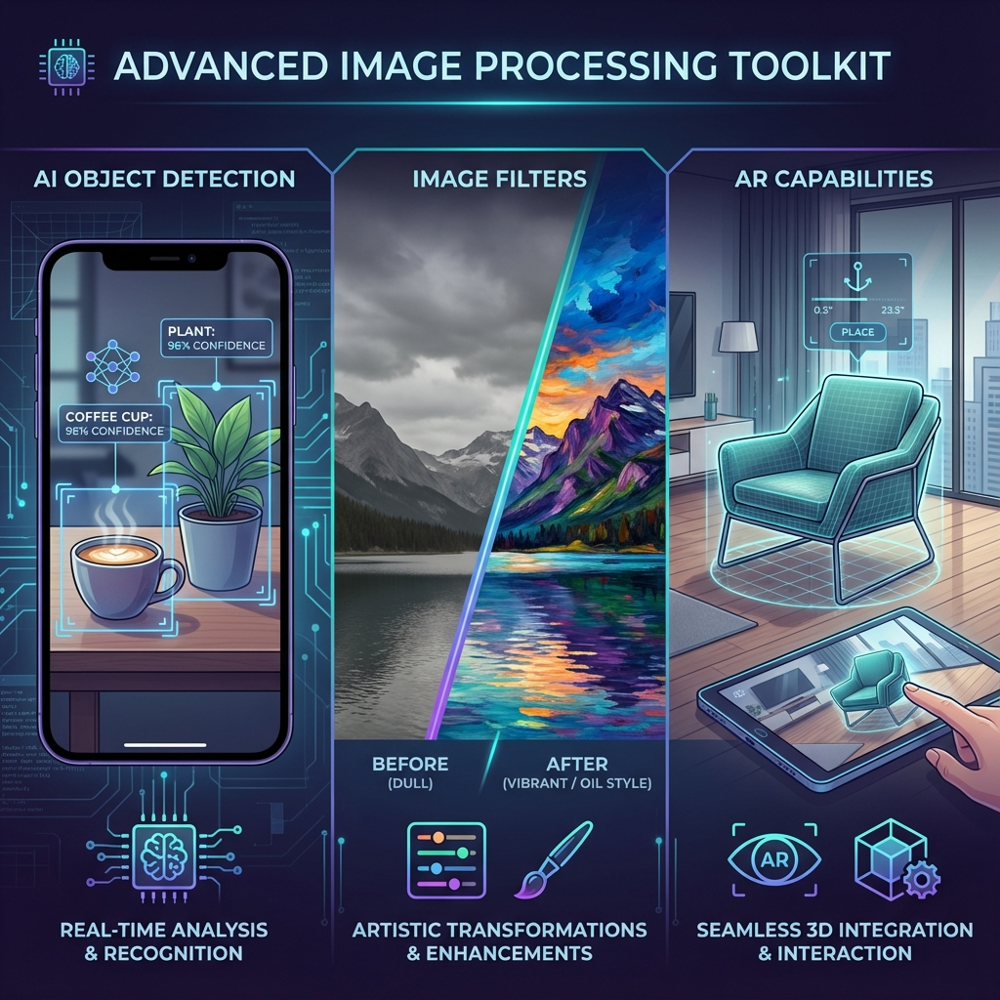

# Advanced Image Processing Toolkit



> **Filters, geometric transforms, watermarking, ML-powered detection, and AR hooks for Flutter.**

A Flutter package that combines:

- **Filters** — grayscale, blur, brightness, sepia, invert, vignette,
  watercolor, oil-painting, contrast, saturation
- **Geometric transforms** — resize, rotate, crop, flip
- **Watermarking** — image overlay compositing
- **ML detection** — objects, faces, text (OCR), human pose via Google ML Kit
- **Augmented reality** — method-channel bindings (BYO ARKit/ARCore plugins)

## Installation

```yaml
dependencies:
  advanced_image_processing_toolkit: ^0.2.0
```

Filters and transforms run on Android, iOS, and Web. ML Kit detection requires
Android or iOS (Google ML Kit is mobile-only).

### Optional: AR support

AR is **not** bundled — it would balloon the install for every consumer. To
use `AugmentedReality.*`, add the platform AR plugins yourself:

```yaml
dependencies:
  arkit_plugin: ^1.1.0          # iOS
  arcore_flutter_plugin: ^0.1.0 # Android (community-maintained)
```

## Quick start

```dart
import 'package:advanced_image_processing_toolkit/advanced_image_processing_toolkit.dart';

await AdvancedImageProcessingToolkit.initialize(
  enableObjectDetection: true,
  enableAR: false,
);
```

## Filters

All filter methods are **static** on `ImageFilters`, take a `Uint8List`, and
return a `Future<Uint8List>`.

```dart
// Basic
final gray   = await ImageFilters.applyGrayscale(bytes);
final blur   = await ImageFilters.applyBlur(bytes, 5.0);        // sigma
final sepia  = await ImageFilters.applySepia(bytes);
final invert = await ImageFilters.applyInvert(bytes);

// Brightness (delta, -1.0 .. 1.0)
final brighter = await ImageFilters.adjustBrightness(bytes, 0.5);
final darker   = await ImageFilters.adjustBrightness(bytes, -0.5);

// Contrast / saturation (multiplier, 1.0 is neutral)
final contrasty = await ImageFilters.adjustContrast(bytes, 1.5);
final vivid     = await ImageFilters.adjustSaturation(bytes, 1.2);
```

### Artistic effects

```dart
final vignette = await ImageFilters.applyVignette(
  bytes,
  intensity: 0.5,  // 0..1
  radius: 0.5,     // 0..1
);

final watercolor = await ImageFilters.applyWatercolor(
  bytes,
  radius: 5,       // blur radius
  intensity: 0.6,
);

final oil = await ImageFilters.applyOilPainting(
  bytes,
  radius: 4,       // brush size
  levels: 20,      // colour quantisation
);
```

### Geometric transforms

```dart
final resized = await ImageFilters.applyResize(bytes, width: 800); // height auto
final rotated = await ImageFilters.applyRotate(bytes, 90.0);
final cropped = await ImageFilters.applyCrop(bytes, 100, 100, 400, 400);
final flipped = await ImageFilters.applyFlip(bytes, horizontal: true);
```

### Watermarking

```dart
final watermarked = await ImageFilters.applyWatermark(
  baseBytes,
  logoBytes,
  x: 50,
  y: 50,
  opacity: 0.5,
);
```

### Filter chains

Filters compose by simply passing the output of one into the next:

```dart
var out = await ImageFilters.applyGrayscale(bytes);
out     = await ImageFilters.adjustContrast(out, 1.2);
out     = await ImageFilters.applyVignette(out, intensity: 0.3);
```

## ML Kit detection

`ObjectRecognition.detectObjectsFromPath` runs **object detection, face
detection, pose estimation, and text recognition** in parallel and returns
a unified list of `DetectedObject`. Filter by `label` to slice the kind of
detection you want.

```dart
final detections =
    await ObjectRecognition.detectObjectsFromPath('/path/to/photo.jpg');

for (final d in detections) {
  switch (d.label) {
    case 'Face':
      final smiling = d.additionalData?['smilingProbability'] as double?;
      print('Face (smile=$smiling) at ${d.boundingBox}');
    case 'Text':
      print('OCR: ${d.additionalData?['text']}');
    case 'Person':
      print('Pose with ${(d.additionalData?['landmarks'] as List).length} landmarks');
    default:
      print('${d.label} (${(d.confidence * 100).toStringAsFixed(0)}%) at ${d.boundingBox}');
  }
}
```

ML Kit requires a file path or accurate `InputImageMetadata`. If you have
raw bytes and you know the image's width/height/stride/format:

```dart
final detections = await ObjectRecognition.detectObjectsFromBytes(
  bytes,
  InputImageMetadata(
    size: Size(width.toDouble(), height.toDouble()),
    rotation: InputImageRotation.rotation0deg,
    format: InputImageFormat.bgra8888,
    bytesPerRow: width * 4,
  ),
);
```

Call `ObjectRecognition.dispose()` when your app is shutting down to release
the underlying ML Kit detectors.

## Augmented reality

```dart
if (AugmentedReality.isARSupported()) {
  await AugmentedReality.startARSession();
  await AugmentedReality.placeModel(
    modelPath: 'assets/models/chair.glb',
    position: [0, 0, -1],   // x, y, z
    scale: 1.0,
    rotation: [0, 0, 0],
  );
  // ...
  await AugmentedReality.stopARSession();
}
```

`isARSupported()` only checks the OS — it does not verify the consumer app
has actually added `arkit_plugin` / `arcore_flutter_plugin`. AR calls return
`false` and log a warning if the channel isn't wired.

## Platform support

| Platform | Filters & transforms | ML detection | AR |
| --- | --- | --- | --- |
| Android | Yes | Yes | Yes (with ARCore plugin) |
| iOS | Yes | Yes | Yes (with ARKit plugin) |
| Web | Yes | No (throws `UnsupportedError`) | No |
| Desktop | Yes | No | No |

## Performance tips

Run heavy filters off the UI thread with `compute`:

```dart
final out = await compute(_grayscale, bytes);
Uint8List _grayscale(Uint8List b) =>
    /* call ImageFilters.applyGrayscale here */;
```

Resize first, then process — Gaussian blur and oil-painting are quadratic in
pixel count:

```dart
final small = await ImageFilters.applyResize(huge, width: 1920);
final out   = await ImageFilters.applyBlur(small, 5);
```

## API reference

See [API_REFERENCE.md](API_REFERENCE.md).

## Author

**Godfrey Lebo** — Fullstack Developer & Technical PM

- Email: [emorylebo@gmail.com](mailto:emorylebo@gmail.com)
- LinkedIn: [godfreylebo](https://www.linkedin.com/in/godfreylebo/)
- Portfolio: [godfreylebo.dev](https://www.godfreylebo.dev/)
- GitHub: [@emorilebo](https://github.com/emorilebo)

## License

MIT — see [LICENSE](LICENSE).
